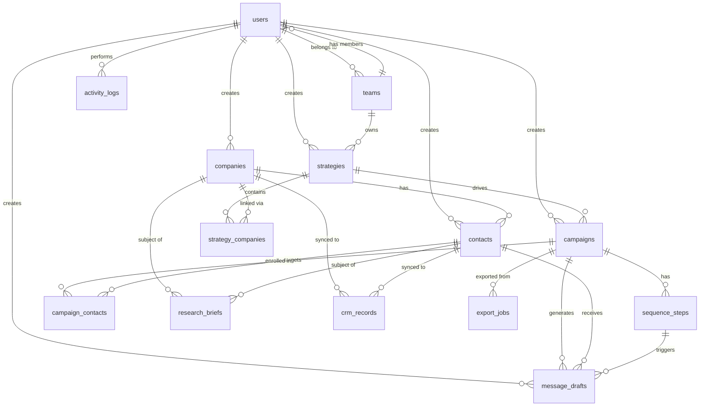

# SalesPilot — Database Schema

All tables inherit common columns from the Base model:
- `id` UUID PRIMARY KEY (auto-generated)
- `created_at` TIMESTAMPTZ NOT NULL DEFAULT now()
- `updated_at` TIMESTAMPTZ NOT NULL DEFAULT now() (auto-updated)
- `is_deleted` BOOLEAN NOT NULL DEFAULT false (soft delete)

## Entity Relationship Diagram

## Tables

### users
| Column         | Type          | Constraints              |
|----------------|---------------|--------------------------|
| email          | VARCHAR(255)  | UNIQUE, NOT NULL, INDEX  |
| password_hash  | VARCHAR(255)  | NOT NULL                 |
| full_name      | VARCHAR(255)  | NOT NULL                 |
| role           | VARCHAR(50)   | NOT NULL, DEFAULT 'sales_rep' |
| team_id        | UUID          | FK -> teams.id, NULLABLE |
| is_active      | BOOLEAN       | NOT NULL, DEFAULT true   |
| last_login_at  | TIMESTAMPTZ   | NULLABLE                 |

Roles: admin, manager, sales_rep, ops, reviewer

### teams
| Column      | Type          | Constraints              |
|-------------|---------------|--------------------------|
| name        | VARCHAR(255)  | NOT NULL                 |
| description | TEXT          | NULLABLE                 |
| created_by  | UUID          | FK -> users.id, NOT NULL |

### strategies
| Column        | Type          | Constraints              |
|---------------|---------------|--------------------------|
| team_id       | UUID          | FK -> teams.id, NULLABLE |
| created_by    | UUID          | FK -> users.id, NOT NULL |
| name          | VARCHAR(255)  | NOT NULL                 |
| description   | TEXT          | NULLABLE                 |
| filters       | JSON          | NOT NULL                 |
| status        | VARCHAR(20)   | NOT NULL, DEFAULT 'draft' |
| company_count | INTEGER       | NOT NULL, DEFAULT 0      |

Status values: draft, active, archived

### strategy_companies
| Column      | Type          | Constraints              |
|-------------|---------------|--------------------------|
| strategy_id | UUID          | FK -> strategies.id, NOT NULL, INDEX |
| company_id  | UUID          | FK -> companies.id, NOT NULL, INDEX  |
| added_at    | TIMESTAMPTZ   | NOT NULL, DEFAULT now()  |

UNIQUE(strategy_id, company_id)

### companies
| Column          | Type          | Constraints              |
|-----------------|---------------|--------------------------|
| name            | VARCHAR(255)  | NOT NULL                 |
| domain          | VARCHAR(255)  | UNIQUE, INDEX, NULLABLE  |
| industry        | VARCHAR(255)  | NULLABLE                 |
| sub_industry    | VARCHAR(255)  | NULLABLE                 |
| geography       | VARCHAR(255)  | NULLABLE                 |
| city            | VARCHAR(255)  | NULLABLE                 |
| country         | VARCHAR(100)  | NULLABLE                 |
| employee_count  | INTEGER       | NULLABLE                 |
| revenue_range   | VARCHAR(100)  | NULLABLE                 |
| travel_intensity| VARCHAR(20)   | NULLABLE                 |
| icp_score       | FLOAT         | NULLABLE                 |
| score_breakdown | JSON          | NULLABLE                 |
| source          | VARCHAR(100)  | NULLABLE                 |
| linkedin_url    | VARCHAR(500)  | NULLABLE                 |
| website         | VARCHAR(500)  | NULLABLE                 |
| created_by      | UUID          | FK -> users.id, NOT NULL |

### contacts
| Column             | Type          | Constraints              |
|--------------------|---------------|--------------------------|
| company_id         | UUID          | FK -> companies.id, NOT NULL, INDEX |
| first_name         | VARCHAR(255)  | NULLABLE                 |
| last_name          | VARCHAR(255)  | NULLABLE                 |
| email              | VARCHAR(255)  | NULLABLE                 |
| email_verified     | BOOLEAN       | NOT NULL, DEFAULT false  |
| phone              | VARCHAR(50)   | NULLABLE                 |
| job_title          | VARCHAR(255)  | NULLABLE                 |
| persona_type       | VARCHAR(50)   | NULLABLE                 |
| linkedin_url       | VARCHAR(500)  | NULLABLE                 |
| confidence_score   | FLOAT         | NULLABLE                 |
| enrichment_status  | VARCHAR(20)   | NOT NULL, DEFAULT 'pending', INDEX |
| enrichment_source  | VARCHAR(100)  | NULLABLE                 |
| enriched_at        | TIMESTAMPTZ   | NULLABLE                 |
| source             | VARCHAR(100)  | NULLABLE                 |
| notes              | TEXT          | NULLABLE                 |
| is_primary         | BOOLEAN       | NOT NULL, DEFAULT false  |
| created_by         | UUID          | FK -> users.id, NOT NULL |

UNIQUE(email, company_id)
Persona types: executive, decision_maker, champion, influencer

### research_briefs
| Column          | Type          | Constraints              |
|-----------------|---------------|--------------------------|
| company_id      | UUID          | FK -> companies.id, NULLABLE |
| contact_id      | UUID          | FK -> contacts.id, NULLABLE  |
| brief_type      | VARCHAR(50)   | NOT NULL                 |
| content         | JSON          | NOT NULL                 |
| generated_by    | VARCHAR(100)  | NULLABLE                 |
| llm_model_used  | VARCHAR(100)  | NULLABLE                 |
| expires_at      | TIMESTAMPTZ   | NULLABLE                 |

### campaigns
| Column        | Type          | Constraints              |
|---------------|---------------|--------------------------|
| strategy_id   | UUID          | FK -> strategies.id, NULLABLE, INDEX |
| name          | VARCHAR(255)  | NOT NULL                 |
| description   | TEXT          | NULLABLE                 |
| campaign_type | VARCHAR(50)   | NOT NULL, DEFAULT 'intro' |
| tone_preset   | VARCHAR(50)   | NOT NULL, DEFAULT 'consultative' |
| status        | VARCHAR(20)   | NOT NULL, DEFAULT 'draft' |
| created_by    | UUID          | FK -> users.id, NOT NULL |
| approved_by   | UUID          | FK -> users.id, NULLABLE |
| approved_at   | TIMESTAMPTZ   | NULLABLE                 |
| starts_at     | TIMESTAMPTZ   | NULLABLE                 |
| ends_at       | TIMESTAMPTZ   | NULLABLE                 |

Status values: draft, active, paused, completed

### sequence_steps
| Column           | Type          | Constraints              |
|------------------|---------------|--------------------------|
| campaign_id      | UUID          | FK -> campaigns.id, NOT NULL, INDEX |
| step_number      | INTEGER       | NOT NULL                 |
| delay_days       | INTEGER       | NOT NULL                 |
| step_type        | VARCHAR(50)   | NOT NULL, DEFAULT 'email' |
| subject_template | TEXT          | NULLABLE                 |
| body_template    | TEXT          | NULLABLE                 |
| is_ai_generated  | BOOLEAN       | NOT NULL, DEFAULT true   |

UNIQUE(campaign_id, step_number)

### campaign_contacts
| Column       | Type          | Constraints              |
|--------------|---------------|--------------------------|
| campaign_id  | UUID          | FK -> campaigns.id, NOT NULL, INDEX |
| contact_id   | UUID          | FK -> contacts.id, NOT NULL, INDEX  |
| status       | VARCHAR(20)   | NOT NULL, DEFAULT 'active' |
| current_step | INTEGER       | NOT NULL, DEFAULT 0      |
| added_at     | TIMESTAMPTZ   | NOT NULL, DEFAULT now()  |

UNIQUE(campaign_id, contact_id)
Status values: active, completed, replied, stopped, bounced

### message_drafts
| Column           | Type          | Constraints              |
|------------------|---------------|--------------------------|
| sequence_step_id | UUID          | FK -> sequence_steps.id, NULLABLE, INDEX |
| contact_id       | UUID          | FK -> contacts.id, NOT NULL, INDEX |
| campaign_id      | UUID          | FK -> campaigns.id, NOT NULL, INDEX |
| subject          | TEXT          | NULLABLE                 |
| body             | TEXT          | NOT NULL                 |
| tone             | VARCHAR(50)   | NULLABLE                 |
| variant_label    | VARCHAR(100)  | NULLABLE                 |
| context_data     | JSON          | NULLABLE                 |
| status           | VARCHAR(20)   | NOT NULL, DEFAULT 'draft' |
| approved_by      | UUID          | FK -> users.id, NULLABLE |
| approved_at      | TIMESTAMPTZ   | NULLABLE                 |
| sent_at          | TIMESTAMPTZ   | NULLABLE                 |
| opened_at        | TIMESTAMPTZ   | NULLABLE                 |
| replied_at       | TIMESTAMPTZ   | NULLABLE                 |
| error_message    | TEXT          | NULLABLE                 |
| scheduled_for    | TIMESTAMPTZ   | NULLABLE                 |
| created_by       | UUID          | FK -> users.id, NOT NULL |

Indexes: (campaign_id, status), (contact_id, status)
Status values: draft, pending_approval, approved, sent, failed, replied

### crm_records
| Column       | Type          | Constraints              |
|--------------|---------------|--------------------------|
| company_id   | UUID          | FK -> companies.id, NULLABLE |
| contact_id   | UUID          | FK -> contacts.id, NULLABLE  |
| crm_type     | VARCHAR(50)   | NOT NULL                 |
| external_id  | VARCHAR(255)  | NULLABLE                 |
| sync_status  | VARCHAR(20)   | NOT NULL                 |
| payload      | JSON          | NULLABLE                 |
| synced_at    | TIMESTAMPTZ   | NULLABLE                 |

### export_jobs
| Column       | Type          | Constraints              |
|--------------|---------------|--------------------------|
| created_by   | UUID          | FK -> users.id, NOT NULL |
| export_type  | VARCHAR(50)   | NOT NULL                 |
| filters      | JSON          | NULLABLE                 |
| status       | VARCHAR(20)   | NOT NULL, DEFAULT 'pending' |
| file_url     | VARCHAR(1000) | NULLABLE                 |
| row_count    | INTEGER       | NULLABLE                 |
| error_message| TEXT          | NULLABLE                 |
| completed_at | TIMESTAMPTZ   | NULLABLE                 |

### activity_logs
| Column      | Type          | Constraints              |
|-------------|---------------|--------------------------|
| user_id     | UUID          | FK -> users.id, NOT NULL |
| action      | VARCHAR(255)  | NOT NULL                 |
| entity_type | VARCHAR(100)  | NULLABLE                 |
| entity_id   | UUID          | NULLABLE                 |
| details     | JSON          | NULLABLE                 |
| ip_address  | VARCHAR(45)   | NULLABLE                 |
